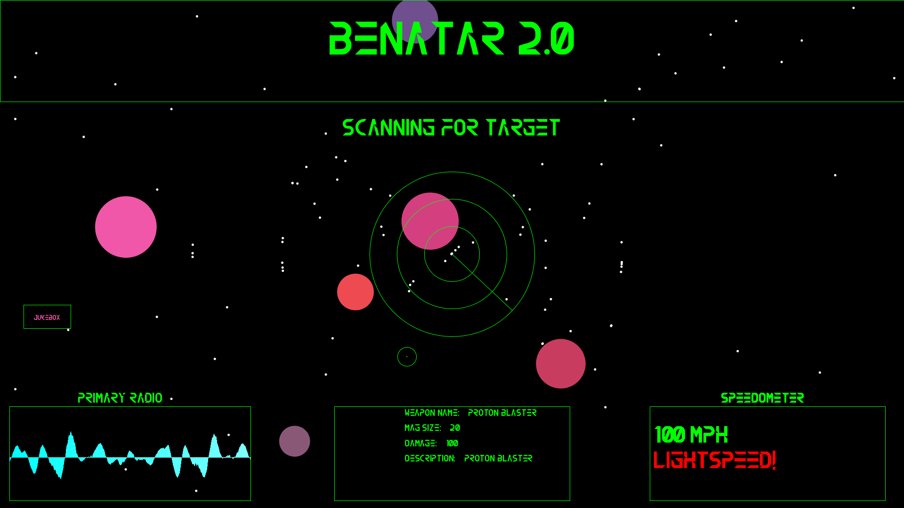

# SciFi UI Project

Name: Glenn Moore

Student Number: C17390923


# Description of the assignment
For this assignment, I decided to do a UI for a Sci-Fi spaceship. The ship I took inspiration from was the 
Benatar in Guardians of the Galaxy. I am a huge fan of this film and decided to try my hand at making a functioning ship appear. 
I included controls for making the ship move faster, and also experimented with playing sound in the sketch, specifically,
the Awesome Mix Vol.1 from the original movie.

# Instructions
Below are the buttons and keys that can be pressed and the corresponding functionality behind each one.
This is a table:

| Button/Key | Function |
|-----------|-----------|
|S key | When pressed, ship should double in speed (ie go to lightspeed), speedometer will change |
|W key | When pressed, will return the speed of the ship back to it's default (50mph) |
|Jukebox button on screen | When clicked, will change tracks on the Awesome Mix soundtrack. |
|Soundwave | When you speak or make noise, the waves will move. |


# How it works
Here is a list of classes I have used in the assignment in order to make my UI the best it could be:

### UI.java 
This was my main class. It created the instances of all my other subclasses, as well as the work I did with the Minim library
(as I has issues trying to implement it in a subclass). The draw() method here essentially drew the entire UI and contained the 
ArrayLists used in the procedural animation.

```Java
public class UI extends PApplet
{
    Button b;
    Radar r;
    IOBox iob;
    Logo l;
    boolean[] keys = new boolean[1024];
    IOBox iob2;

    AudioPlayer music1;
    AudioPlayer music2;
    AudioPlayer music3;
    AudioPlayer music4;
    AudioPlayer music5;
    AudioPlayer music6;
    AudioPlayer music7;
    AudioPlayer music8;
    AudioPlayer music9;
    AudioPlayer music10;
    AudioPlayer music11;
    AudioInput ai;
    FFT fft;
    Minim minim;
    public static final int FRAME_SIZE = 1024;
    public static final int SAMPLE_RATE = 44100;
    public static final int BITS_PER_SAMPLE = 16;

    public int jukebox = 0;

    private ArrayList<Weapon> weapons = new ArrayList<Weapon>();
    public ArrayList<Sprite> sprites = new ArrayList<Sprite>();

    public void keyPressed()
    {
        keys[keyCode] = true;
    }
    
    public void keyReleased()
    {
        keys[keyCode] = true;
    }

    public boolean checkKey(int c)
    {
        return keys[c] || keys [Character.toUpperCase(c)];
    }
    

    public void settings()
    {
        //size(800, 800);
        // Use fullscreen instead of size to make your interface fullscreen
       fullScreen(); 
       minim = new Minim(this);
        ai = minim.getLineIn(Minim.MONO, FRAME_SIZE, SAMPLE_RATE, BITS_PER_SAMPLE);
        fft = new FFT(FRAME_SIZE, SAMPLE_RATE);
    }

    public void setup()
    {
       // Minim minim = new Minim(this);
        music1 = minim.loadFile("track1.mp3");
        music2 = minim.loadFile("track2.mp3");
        music3 = minim.loadFile("track3.mp3");
        music4 = minim.loadFile("track4.mp3");
        music5 = minim.loadFile("track5.mp3");
        music6 = minim.loadFile("track6.mp3");
        music7 = minim.loadFile("track7.mp3");
        music8 = minim.loadFile("track8.mp3");
        music9 = minim.loadFile("track9.mp3");
        music10 = minim.loadFile("track10.mp3");
        music11 = minim.loadFile("track11.mp3");

        PFont fnt = createFont("HADES.otf",40);
        textFont(fnt);

        b = new Button(this, 50, height*0.6f, 100, 50, "JUKEBOX");
        r = new Radar(this,width/2,height/2, 350);
        iob = new IOBox(this, (width/2)-250, height *0.8f,500,200);
        l = new Logo(this,0, 0, width,height/5, "BENATAR 2.0");
        iob2 = new IOBox(this, width-540, height*0.8f, 500,200);

        for (int i = 0; i <= 5; i++)
        sprites.add(new Planet(this));

        for (int i = 0; i <= 100; i++)
        sprites.add(new Star(this));

        loadData();
        printWeapons();
    }
```

```Java
    public void draw()
    {
        background(0);

        float now = millis();
        timeDelta = (now - last) / 1000.0f;
        last = now;
        
        fill(0);

        for(int i= sprites.size() - 1; i >= 0; i--)
        {
            Sprite s = sprites.get(i);
            s.render();
            s.update();
        }

        b.render();
   
        r.render();
        r.update();

        iob.render();
        iob2.render();


        drawWeapons();

        l.render();
        

        ellipse(mouseX,mouseY, 40,40);
        ellipse(mouseX, mouseY,1,1);
        noCursor();

        stroke(0,255,0);
        float audioHeight = height*0.9f;
        float gap = 20;
        float audioWidth = ai.bufferSize()/2;
        float middle = audioHeight; 

        rect(gap, height *0.8f,audioWidth,200);
        textSize(30);
        text("Primary Radio", audioWidth/2, height * 0.78f);

        for(int i = 0 ; i < audioWidth ; i ++)
        {
            stroke(map(i, 0, ai.bufferSize(), 0, 255), 255, 255); 
            line(i+gap, middle, i+gap, middle + ai.left.get(i) *middle/6);
        }

        fft.forward(ai.left);
    }

```
### Radar.java 
This was a fairly basic class, it draws a radar to the screen and uses the unit circle/trigonometry to make it move in the
update() method.

```Java
   public Radar(PApplet ui, float x, float y, float diameter) {
        this.ui = ui;
        this.theta = 0;
        this.x = x;
        this.y = y;
        this.diameter = diameter;
        radius = diameter / 2;
        this.x2 = 0;
        this.y2 = radius;
        this.gap = ui.height * 0.8f;
    }

    public void render() {
        x2 = (float) (Math.sin(theta) * (radius)) + x;
        y2 = (float) (-Math.cos(theta) * (radius)) + y;
        ui.stroke(0, 255, 0);
        ui.noFill();

        float circleGap = diameter / 3;
        for (int i = 0; i <= 2; i++) {
            ui.ellipse(x, y, diameter - (circleGap * i), diameter - (circleGap * i));
        }
        ui.fill(0,255,0);
        ui.textAlign(PApplet.CENTER, PApplet.CENTER);
        ui.textSize(50);
        ui.text("SCANNING FOR TARGET", x, y- radius - 100);
        ui.line(x,y,x2,y2);
        ui.noFill();

    }

    public void update()
    {
        theta += 0.05;
    }
```

### IOBox.java
This drew the boxes for the soundwave, weapon, speedometer etc.
```Java
    public IOBox(PApplet ui, float x, float y, float boxWidth, float boxHeight) {
        this.ui = ui;
        this.x = x;
        this.y = y;
        this.boxWidth = boxWidth;
        this.boxHeight = boxHeight;
    }

    public void render() {
        ui.stroke(0,255,0);
        ui.noFill();

        ui.rect(x,y,boxWidth,boxHeight);
    }
```

### Logo.java
This made the box for the Benatar logo.
```Java
    public void render() {
        ui.noFill();
        ui.stroke(0,255,0);
        ui.rect(x,y,rectWidth,rectHeight);
        ui.textAlign(PApplet.CENTER, PApplet.CENTER);
        ui.textSize(100);
        ui.text(txt, (ui.width/2), rectHeight * 0.33f);

      }
```
### Main.java
This was simply used to run the UI.
```Java
	public void startUI()
	{
		String[] a = {"MAIN"};
        processing.core.PApplet.runSketch( a, new UI());
		
	}
	
	public static void main(String[] args)
	{
		Main main = new Main();
		main.startUI();			
	}
```
### Sprite.java
An abstract class used for the stars and planets. The two classes implemented the render() and update() methods,
but in different ways.

```Java

public abstract class Sprite
{
    protected PVector pos;
    protected PVector forward;
    protected float rotation;
    protected float speed;
    protected UI ui;


    public Sprite(UI ui, float x, float y, float rotation,float speed)
    {
        this.ui = ui;
        pos = new PVector(x,y);
        forward = new PVector(0,-1);
        this.rotation = rotation;
        this.speed = speed;
    }

    public abstract void update();

    public abstract void render();
}
```

### Planet.java
The Planet class that extends Sprite and overrides the render() and update() methods.
```Java
   @Override
    public void update() {
        //pos =+ forward * speed;
        pos.add(PVector.mult(forward, speed));
        rotation += 0.01f;

        if (pos.x < 0)
        {
            pos.x = ui.width;
        }
        if (pos.x > ui.width)
        {
            pos.x = 0;
        }
        if (pos.y < 0)
        {
            pos.y = ui.height;
        }
        if (pos.y > ui.height)
        {
            pos.y = 0;
        }
    }

    int size = 20;
    float planetSize = ui.random(50,150);
    float r = ui.random(30,255);
    float g = ui.random(50,100);
    float b = ui.random(70,180);

    @Override
    public void render() {
        ui.noStroke();
        ui.pushMatrix();
        ui.translate(pos.x, pos.y);
        ui.rotate(rotation);
        ui.fill(r,g,b);
        ui.ellipse(-size / 2, -size / 2, planetSize, planetSize);
        ui.popMatrix();
    }
}
```

### Star.java
Similar to Planet, procedurally generates stars by method overriding.
```Java
    @Override
    public void update() {
        //pos =+ forward * speed;
        pos.add(PVector.mult(forward, speed));
        rotation += 0.01f;
        
        if (ui.keyPressed)
        {
            if (ui.key == 's' || ui.key == 'S')
            {
                this.speed = 10;
                mph = 100;
            }

            else if (ui.key == 'w' || ui.key == 'W'){
                this.speed = 5;
                mph = 50;
             }
        }

         if (pos.x < 0)
         {
             pos.x = ui.width/2 - 1;
             pos.y = ui.height/2;
         }

         if (pos.x > ui.width)
         {
             pos.x = ui.width/2 + 1;
             pos.y = ui.height/2;
         }

        if (pos.y < 0)
        {
            pos.x = ui.width/2;
            pos.y = ui.height/2 -1;

        }
        if (pos.y > ui.height)
        {
            pos.x = ui.width/2;
            pos.y = ui.height/2 +1;
        }
    } 

    public void drawText()
    {
       ui.fill(0,255,0);
       ui.textSize(30);
       ui.text("Speedometer", ui.width-300, ui.height * 0.78f);
       ui.textSize(50);
       ui.text(mph + " MPH", ui.width-450, ui.height*0.85f);

       if (mph == 100)
       {
           
           ui.fill(255,0,0);
           ui.text("LIGHTSPEED!", ui.width-400, ui.height*0.9f);
       }
    }

    int size = 1;

    

    @Override
    public void render() {
        ui.noStroke();
        ui.pushMatrix();
        ui.translate(pos.x, pos.y);
        ui.rotate(rotation);
        ui.fill(255);
        ui.ellipse(-size / 2, -size / 2,5,5);
        ui.popMatrix();
        drawText();
    }
```

### Button.java
Used to make button, which I used for the Awesome Mix control.
```Java
    public void render()
    {
        float start = x;
        float w = width;
        float h = height;

        ui.noFill();
        ui.stroke(0,255,0);
        ui.rect(x, y, width, height);
        ui.textAlign(PApplet.CENTER, PApplet.CENTER);
        ui.textSize(15);
        ui.text(text, x + width * 0.5f, y + height * 0.5f);

        if (ui.mouseX > x && ui.mouseX < start + w 
        && ui.mouseY > y && ui.mouseY < y + h)
        {
            ui.fill(255,0,0);
        }
    }  
```

### Weapon.java
Loads a list of weapons from a .csv file.
```Java
    public Weapon(TableRow row)
    {
        weaponName = row.getString("Weapon Name");
        damage = row.getInt("Damage");
        magSize = row.getInt("Mag Size");
        desc = row.getString("Desc");
    }
```

# What I am most proud of in the assignment
The thing that I am most proud of in my assignment is the fact that I was able to successfully import sound in a way that the 
user can interact with it. Adding the soundtrack and giving the user the ability to change the song both allowed me to learn
more about how the Minim library works and also lets the user interact with my assignment in a meaningful way.

Another thing I am proud of is how I managed to successfully animate both stars and planes procedurally. I experiemented
with using abstract classes, PVectors, and ArrayLists among others to allow this to happen. I kept both stars and planets in
the same arrayList (called sprites) and was able to animate each of them in a different way by overriding the methods in the 
abstract class. Given how I struggled with basic drawing and animation in Processing for a very long time, I am happy to say
that I am now able to procedurally animate my own background for a sketch.

Lastly, I was impressed by my ability to use File I/0 correctly. I struggled a lot with importing .csv files and understanding
how they worked, but I was able to implement it with the weapons.csv file. I was also able to successfully import sound files
too, which was a great learning experience for me.


A couple of images of my assignment in action:




This is a YouTube video of my assignment in action:

[![YouTube]](https://www.youtube.com/watch?v=GioGgRyYHPg&feature=youtu.be)


